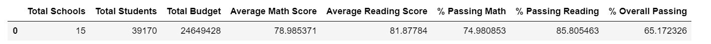
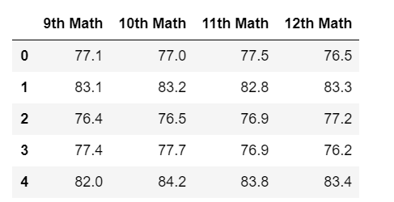
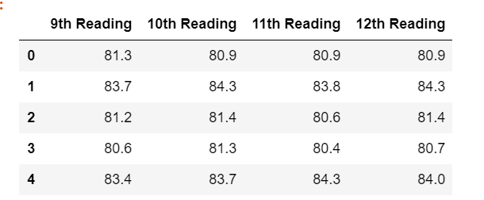
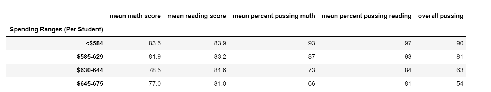
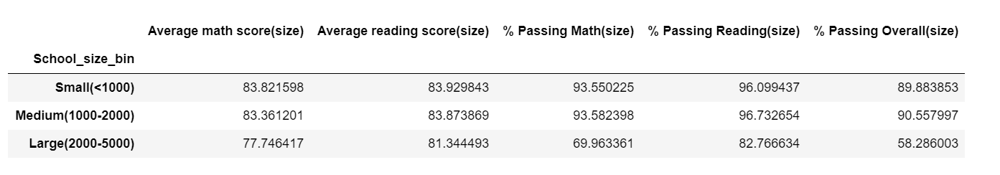
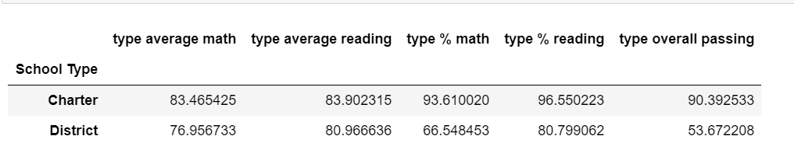

# School_District_Analysis

## Overview of Project

### Purpose
The school board suspects that the Math and Reading scores for 9th graders at Thomas High School have been messed up. 
The analysis includes to remove those scores and analyse how is the performance affected of the school disctrict analysis. 

## Results

### District Summary
1. There were 461(1.2%) students whose Math and Reading scores were nullified out of total 39,170 students. 
2. By doing so we see percentage count of students who scored more than 70% in maths drops by 0.2 and percentage of students who scored more than 
   70% in Reading drops by 0.1.  Also the percentage count of students who scored more than 70% in both math and reading dropped by 0.3. 
3. Hence we do not see much difference in the overall data with or without removing the marks for students in 9th grade at Thomas High School. 
   - Disctrict high school summary with nullified 9th grade data at Thomas High School
   
   - Disctrict high school summary with all data
   
   
### School Summary
1. For Thomas High School, the percentage of students who scored more than 70% in math, reading and both together remain almost same after removing the 
   9th grade data. 
   - Thomas High school summary with all the data
   
   - Thomas High school summary excluding 9th grade data
   

### School Summary

### By replacing the ninth-grade scores
1. Math and reading scores by grade
   - By replacing the ninth-grade scores to nan, we do not notice much different to the overall data.
    Math Score By grade:
	
	Reading Score By grade:
	

2. Scores by school spending 
   - By replacing the ninth-grade scores to nan, we do not any difference in the scores. 
    Which means ninth-grade scores at Thomas High Scool did not 
    make any change to the overall scores. 
	Score by school spending:
	
	
3. Scores by school size
   - Size of Thomas high school is Medium and the scores for the school remained same 
     even after editing the 9th grade scores. 
    
	
4. Scores by school type
   - Thomas High Schools is a Charter type of school and the scores of this type of 
     schools did not affect much by removing scores to null.
    
	
	 
 
## Summary