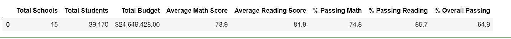

# School_District_Analysis

## Overview of Project

### Purpose
The school board suspects that the Math and Reading scores for 9th graders at Thomas High School have been messed up. 
The analysis includes to remove those scores and analyse how is the performance affected of the school disctrict analysis. 

## Results

### District Summary
1. There were 461(1.2%) students whose Math and Reading scores were nullified out of total 39,170 students. 
2. By doing so we see percentage count of students who scored more than 70% in maths drops by 0.2 and percentage of students who scored more than 
   70% in Reading drops by 0.1.  Also the percentage count of students who scored more than 70% in both math and reading dropped by 0.3. 
3. It indicates that the students at Thomas High School in 9th grade did not perform well and scored very less than the average percentage. 
   Hence we do not see much difference in the overall data with our without removing the marks for students in 9th grade at Thomas High School. 
   - Disctrict high school summary with nullified 9th grade data at Thomas High School
   
   - Disctrict high school summary with all data
   